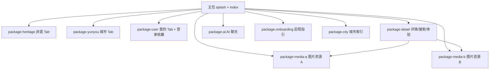

# 小程序包体积优化报告

> 优化日期：2026-06-17  
> 目标：主包 < 1.4MB，消除代码质量警告，分包加载重型功能

---

## 一、优化前后对比

| 项目 | 优化前（约） | 优化后（约） |
|------|-------------|-------------|
| 主包大小 | **4937 KB**（超限） | **~1365 KB** |
| 总包大小 | ~12 MB+ | ~12 MB（资源拆至分包） |
| 主包页面数 | 24 | **2**（splash + index） |
| Tab 页位置 | 主包 | **分包**（heritage / yunyou / profile） |
| 图片 >200KB（主包） | logo 489KB + banner 1.1MB | logo **129KB** |
| 未使用 JS 警告 | 9 个文件 | **已迁入分包** |
| 本地视频 | 0 | 0（本就无 mp4） |

> 请在微信开发者工具中 **清缓存 → 重新编译 → 代码质量** 以获取精确数值。

---

## 二、主包结构（优化后）

```
主包 pages/
├── splash/          # 启动页
└── index/           # 首页（Tab）

主包保留：app.js / app.json / custom-tab-bar / i18n / 轻量 data / utils/storage 等
```

**说明：** 微信 TabBar 页面已配置为分包路径（基础库 2.5+ 支持），主包不再包含 heritage / yunyou / profile 页面代码。

---

## 三、分包结构图



| 分包 | 功能 |
|------|------|
| `package-heritage` | 非遗 Tab、知识列表 |
| `package-yunyou` | 城市 Tab、路线推荐 |
| `package-user` | 我的 Tab、登录、收藏、历史、设置 |
| `package-detail` | 非遗详情、搜索、体验预约、视频 |
| `package-ai` | AI 聊天、识别、路线卡片、吉祥物 |
| `package-onboarding` | 启程指引、语言选择、地图组件 |
| `package-city` | 城市选择 |
| `package-media-a/b` | 非遗封面、轮播图（独立资源包） |

---

## 四、主要修改

### 1. 分包迁移
- Tab 页：`heritage` → `package-heritage`，`yunyou` → `package-yunyou`，`profile` → `package-user`
- AI 模块：`utils/ai-*`、`chat-message`、`guide-mascot` → `package-ai`
- 体验数据：`experience.js` + `experience-items.js` → `package-detail`
- 详情数据：`heritage-details.js` → `package-detail`
- 搜索 / 定位 / 启程：`search`、`geo-location`、`category-covers`、`soft-body-bubble-engine` → 对应分包

### 2. 主包数据瘦身
- `heritages.js` 主包仅保留**列表 API**（无详情字段）
- 新增 `legend-stories.js` 替代首页加载 `heritage-details.js`（省 ~191KB）
- `home-banners.js` 改为静态封面路径
- `recommendation.js` 移至 `package-yunyou`

### 3. 图片优化
- `logo.png`：489KB → **129KB**（缩略 + 压缩）
- `images/banner/`、`images/heritage/`、`images/guide/`、`images/maps/` 已 ignore 或迁分包
- 轮播图使用分包 `package-media-a` 资源

### 4. 配置
- `lazyCodeLoading: requiredComponents`
- `uploadWithSourceMap: false`
- `packOptions.ignore` 扩展（server、scripts、excel、大图目录等）

---

## 五、删除 / 忽略文件

| 文件/目录 | 处理 |
|-----------|------|
| `utils/ai-local-fallback.js` | 已删除（无引用） |
| `components/interest-bubbles/` | 已删除（无引用） |
| `images/heritage/`（~8MB） | packOptions.ignore |
| `images/banner/`（~1.1MB） | packOptions.ignore |
| `images/excel/`（~761KB） | packOptions.ignore |
| `server/`（~4.5MB） | packOptions.ignore |

---

## 六、保留依赖（主包）

| 模块 | 原因 |
|------|------|
| `data/heritage-list.js` | 首页今日推荐索引 |
| `data/legend-stories.js` | 首页传说摘要 |
| `data/cities.js` + `cities-data.js` | 首页城市展示 |
| `data/inheritors.js` | 首页代表传承人 |
| `i18n/` | 全局文案 |
| `images/brand/logo.png` | 启动页 Logo |
| `images/tab/` | Tab 图标（均 <200KB） |

---

## 七、npm 依赖

小程序端**无 package.json / node_modules**，npm 优化不适用。  
`server/package.json` 为可选 Node 后端，已通过 `packOptions.ignore` 排除。

---

## 八、视频

项目中**无本地 mp4/mov**，非遗视频均为外链 URL（`heritage-videos.js`），已符合「不进包体」要求。

---

## 九、后续维护建议

1. **新增页面默认放分包**，主包只加 splash/index 级别入口。
2. **图片 >100KB** 一律放 `package-media-a/b` 或 CDN，主包只用小图标。
3. **数据 JS >50KB** 按页面拆到分包 `data/`，主包用轻量索引文件。
4. 运行 `scripts/split-media-packages.py` 后同步更新分包路径。
5. 上传前检查 **代码质量 → 主包 JS 未使用** 面板，及时迁移误放主包的模块。
6. `config/ai-secret.js` 勿提交 Git；API Key 仅用于 `package-ai`。

---

## 十、验证清单

- [ ] 主包 < 4096KB（硬限制）
- [ ] 主包 < 1.5MB（体验建议）
- [ ] Tab 切换：首页 / 非遗 / 城市 / 我的
- [ ] 详情页、AI 导览、搜索、登录流程
- [ ] 首次启动 → 启程指引 → 首页
